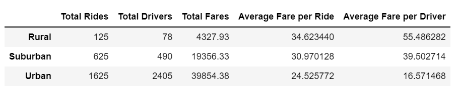
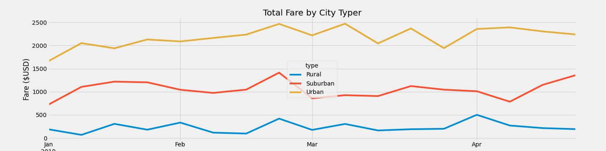

# PyBer_Analysis

## Overview

Analyzing rideshare data with Python, PANDAS, and Matplotlib.

## Background 
Customer's guidance:

* Using Python skills and knowledge of Pandas, create a summary DataFrame of the ride-sharing data by city type was created. 
* Then, using Pandas and Matplotlib, create a multiple-line graph shows the total weekly fares for each city type. * Create a written report that summarizes how the data differs by city type and how those differences can be used by decision-makers at PyBer.

## Overview

## Results

#### 
Observations of Summary Table

#### 
Observations of Fare by City Type

## Summary

### Resources
matplotlib version 3.5.1
